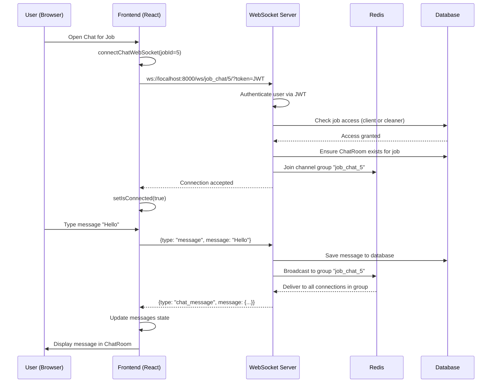

# E-Cleaner Chat Architecture - Complete Analysis

## 📋 Executive Summary

The E-Cleaner platform uses a **hybrid REST + WebSocket architecture** for real-time chat communication. The system is job-centric, creating dedicated chat rooms for each cleaning job between clients and cleaners.

**Current Status**: Fully functional but has complexity issues and redundant patterns.

---

## 🏗️ Architecture Overview

```
┌─────────────────────────────────────────────────────────────────────┐
│                          FRONTEND LAYER                              │
├─────────────────────────────────────────────────────────────────────┤
│                                                                       │
│  ┌──────────────────┐  ┌─────────────────┐  ┌──────────────────┐  │
│  │  ChatContext     │  │ WebSocketContext│  │  useChat Hook    │  │
│  │  (Global State)  │  │  (Connections)  │  │  (Room-specific) │  │
│  └────────┬─────────┘  └────────┬────────┘  └────────┬─────────┘  │
│           │                     │                     │             │
│           ├─────────────────────┴─────────────────────┤             │
│           │                                           │             │
│  ┌────────▼───────────────────────────────────────────▼─────────┐  │
│  │              UI Components Layer                              │  │
│  │  • FloatingChatPanel (Messenger-style slide-in)              │  │
│  │  • ChatList (List of conversations)                          │  │
│  │  • ChatRoom (Message display + input)                        │  │
│  │  • Navigation (Chat icon with badge)                         │  │
│  └───────────────────────────────────────────────────────────────┘  │
│                                                                       │
└───────────────────────────────┬───────────────────────────────────────┘
                                │
                    ┌───────────┴───────────┐
                    │   Network Layer       │
                    │  REST API + WebSocket │
                    └───────────┬───────────┘
                                │
┌───────────────────────────────▼───────────────────────────────────────┐
│                          BACKEND LAYER                                │
├───────────────────────────────────────────────────────────────────────┤
│                                                                        │
│  ┌────────────────────────────────────────────────────────────────┐  │
│  │                    WebSocket Layer                             │  │
│  │  ┌──────────────────┐         ┌────────────────────────┐      │  │
│  │  │  ChatConsumer    │         │  JobChatConsumer       │      │  │
│  │  │  (General chat)  │         │  (Job-specific chat)   │      │  │
│  │  │                  │         │  ✅ Currently Used     │      │  │
│  │  └──────────────────┘         └────────────────────────┘      │  │
│  │  • ws/chat/<room_name>/       • ws/job_chat/<job_id>/         │  │
│  │  • Redis channels              • Redis channels               │  │
│  │  • Group messaging             • Job access control           │  │
│  └────────────────────────────────────────────────────────────────┘  │
│                                                                        │
│  ┌────────────────────────────────────────────────────────────────┐  │
│  │                      REST API Layer                            │  │
│  │  • GET  /chat/rooms/              → Get all user's chat rooms │  │
│  │  • GET  /chat/rooms/{id}/         → Get specific room         │  │
│  │  • GET  /chat/rooms/{id}/messages/→ Get room messages         │  │
│  │  • POST /chat/rooms/{id}/send_message/ → Send message (REST) │  │
│  └────────────────────────────────────────────────────────────────┘  │
│                                                                        │
│  ┌────────────────────────────────────────────────────────────────┐  │
│  │                    Database Models                             │  │
│  │  • ChatRoom (OneToOne with Job)                               │  │
│  │  • Message (Text, images, files, system messages)             │  │
│  │  • ChatParticipant (User status, unread count, typing)        │  │
│  └────────────────────────────────────────────────────────────────┘  │
│                                                                        │
└────────────────────────────────────────────────────────────────────────┘
```

---

## 🔌 WebSocket Architecture

### Connection Flow



### Two Consumer Types

#### 1. **ChatConsumer** (`ws/chat/<room_name>/`)
- **Purpose**: General-purpose chat rooms
- **Use Case**: Support chats, group discussions
- **Access Control**: Any authenticated user
- **Status**: ⚠️ Implemented but NOT currently used
- **Room Creation**: Dynamic by room name

#### 2. **JobChatConsumer** (`ws/job_chat/<job_id>/`) ✅
- **Purpose**: Job-specific communication
- **Use Case**: Client ↔ Cleaner communication for specific jobs
- **Access Control**: Only job client, assigned cleaner, or admin
- **Status**: ✅ **Currently in use**
- **Room Creation**: Automatic when job exists
- **Room Naming**: `job_chat_{job_id}`

---

## 📊 Data Models

### ChatRoom Model
```python
class ChatRoom(models.Model):
    name = models.CharField(max_length=255)
    room_type = models.CharField(choices=['job', 'support', 'general'])
    job = models.OneToOneField(CleaningJob)  # OneToOne relationship
    participants = models.ManyToManyField(User)
    created_at = models.DateTimeField(auto_now_add=True)
    updated_at = models.DateTimeField(auto_now=True)
    is_active = models.BooleanField(default=True)
```

**Key Relationships**:
- `OneToOne` with `CleaningJob` → Each job has exactly ONE chat room
- `ManyToMany` with `User` → Multiple participants (client + cleaner + admin)
- Ordering: `-updated_at` (most recent first)

### Message Model
```python
class Message(models.Model):
    room = models.ForeignKey(ChatRoom)
    sender = models.ForeignKey(User)
    message_type = models.CharField(choices=['text', 'image', 'file', 'system', 'job_update'])
    content = models.TextField()
    attachment = models.FileField(upload_to='chat_attachments/')
    timestamp = models.DateTimeField(auto_now_add=True)
    is_read = models.BooleanField(default=False)
    edited_at = models.DateTimeField(null=True)
    reply_to = models.ForeignKey('self')  # Thread support
```

**Features**:
- Multiple message types (text, image, file, system, job_update)
- Read receipts (`is_read`)
- Message threading (`reply_to`)
- File attachments
- Edit tracking (`edited_at`)

### ChatParticipant Model
```python
class ChatParticipant(models.Model):
    room = models.ForeignKey(ChatRoom)
    user = models.ForeignKey(User)
    joined_at = models.DateTimeField(auto_now_add=True)
    last_seen = models.DateTimeField(auto_now=True)
    is_typing = models.BooleanField(default=False)
    unread_count = models.PositiveIntegerField(default=0)
```

**Purpose**: Track per-user state in each room
- Unread message count per user
- Last seen timestamp
- Typing indicator state
- Join date

---

## 🔄 Message Flow

### Sending a Message

```
User types → ChatRoom component
    ↓
sendMessage('Hello') → useChat hook
    ↓
WebSocket.send({type: 'message', message: 'Hello'})
    ↓
JobChatConsumer.receive() → Backend
    ↓
save_job_message() → Database
    ↓
channel_layer.group_send() → Redis
    ↓
JobChatConsumer.chat_message() → All connected clients
    ↓
handleChatMessage() → WebSocketContext
    ↓
setChatMessages() → Update state
    ↓
window.dispatchEvent('newChatMessage') → Custom event
    ↓
ChatContext listener → Increment unread count
    ↓
UI updates → Message appears in ChatRoom
```

### Message Format

**Frontend → Backend**:
```json
{
  "type": "message",
  "message": "Hello, how are you?",
  "message_type": "text"
}
```

**Backend → Frontend**:
```json
{
  "type": "chat_message",
  "message": {
    "id": 123,
    "sender": {
      "id": 26,
      "username": "cleaner1",
      "first_name": "John"
    },
    "content": "Hello, how are you?",
    "timestamp": "2025-10-25T10:30:00Z",
    "message_type": "text",
    "is_read": false
  }
}
```

---

## 🎯 Frontend State Management

### Three-Layer State Architecture

#### 1. **ChatContext** (Global Chat State)
**Location**: `frontend/src/contexts/ChatContext.jsx`

**Purpose**: Global chat panel state and unread count tracking

**State**:
```javascript
{
  isChatOpen: boolean,           // Is floating panel open?
  totalUnreadCount: number,      // Total unread messages across all rooms
  chatRooms: Array<ChatRoom>     // All user's chat rooms
}
```

**Functions**:
- `toggleChat()` - Open/close floating panel
- `fetchChatData()` - REST API call to get rooms + unread counts
- `incrementUnreadCount()` - Called when new message arrives
- `refreshChatData()` - Manual refresh

**Polling**: Every 30 seconds via REST API

**Real-time Updates**: Listens for `newChatMessage` custom events

#### 2. **WebSocketContext** (Connection Management)
**Location**: `frontend/src/contexts/WebSocketContext.jsx`

**Purpose**: Manage WebSocket connections and raw message handling

**State**:
```javascript
{
  connectionStatus: string,               // 'connecting' | 'connected' | 'disconnected'
  chatMessages: {[roomId]: Message[]},   // Messages by room ID
  notificationWs: WebSocket,             // Notification WebSocket
  chatWebSockets: {[roomId]: WebSocket}  // Chat WebSockets by room
}
```

**Functions**:
- `connectChatWebSocket(jobId)` - Create WebSocket for job chat
- `sendChatMessage(roomId, content)` - Send message via WebSocket
- `handleChatMessage(data)` - Process incoming messages
- Automatic reconnection with exponential backoff

**Dispatches**: `window.dispatchEvent('newChatMessage', {roomId, message})`

#### 3. **useChat Hook** (Room-Specific Logic)
**Location**: `frontend/src/hooks/useWebSocket.js`

**Purpose**: Manage individual chat room WebSocket and UI logic

**Returns**:
```javascript
{
  messages: Message[],          // Messages for this specific room
  isConnected: boolean,         // Room connection status
  typingUsers: User[],          // Users typing in this room
  sendMessage: (content) => void,
  sendTypingIndicator: () => void,
  stopTyping: () => void
}
```

**Usage**: 
```jsx
const { messages, sendMessage, isConnected } = useChat(jobId);
```

**Lifecycle**:
- Connects when component mounts with jobId
- Enhances WebSocket handlers without overwriting
- Cleans up on unmount
- Manages typing indicator timeouts

---

## 🚨 Current Issues & Problems

### 1. **Architectural Complexity** ⚠️
- **Problem**: Three separate state layers (ChatContext, WebSocketContext, useChat) creates confusion
- **Impact**: Difficult to debug, understand data flow, and maintain
- **Example**: Message arrives → WebSocketContext → Custom Event → ChatContext → UI update (too many hops)

### 2. **Dual Consumer Pattern** ⚠️
- **Problem**: Two WebSocket consumers (`ChatConsumer` and `JobChatConsumer`) but only one is used
- **Impact**: Dead code, maintenance burden, potential confusion
- **Status**: `ChatConsumer` is implemented but never used in production

### 3. **Hybrid REST + WebSocket for Same Data** ⚠️
- **Problem**: 
  - REST API: `GET /chat/rooms/` called every 30 seconds
  - WebSocket: Real-time messages via `ws/job_chat/<id>/`
  - Both provide message data
- **Impact**: Redundant API calls, potential race conditions, complexity
- **Example**: User gets message via WebSocket, but unread count comes from REST polling

### 4. **Unread Count Management** ⚠️
- **Problem**: Unread counts calculated in three places:
  1. Backend `ChatParticipant.unread_count` model field
  2. Backend serializer calculates on-the-fly
  3. Frontend ChatContext sums from REST response
- **Impact**: Inconsistent counts, sync issues

### 5. **Message Storage Duplication** ⚠️
- **Problem**: Messages stored in:
  - Database (permanent)
  - WebSocketContext.chatMessages (runtime)
  - ChatRoom component local state (UI)
- **Impact**: Memory usage, potential out-of-sync issues

### 6. **No Pagination** ⚠️
- **Problem**: All messages loaded at once via REST API
- **Impact**: Performance issues with long conversations
- **Example**: 1000 messages = massive initial load

### 7. **OneToOne Job→ChatRoom Constraint** ⚠️
- **Problem**: `ChatRoom.job = OneToOneField(CleaningJob)`
- **Limitation**: Can't have multiple chats per job (e.g., separate support chat)
- **Current Design**: Assumes one chat room per job

### 8. **Typing Indicators in Database** ⚠️
- **Problem**: `ChatParticipant.is_typing` stored in database
- **Impact**: Database writes for ephemeral state (unnecessary)
- **Better Approach**: Handle typing entirely in memory (Redis/WebSocket)

### 9. **Custom Event System** ⚠️
- **Problem**: Using `window.dispatchEvent` for component communication
- **Impact**: Non-standard React pattern, hard to trace, debugging issues
- **Example**: `window.dispatchEvent(new CustomEvent('newChatMessage', {detail: {...}}))`

### 10. **REST Message Sending Endpoint** ⚠️
- **Problem**: `POST /chat/rooms/{id}/send_message/` exists but not used
- **Status**: Dead code - all messages sent via WebSocket
- **Impact**: Maintenance burden, confusion

---

## 🎨 UI Components

### FloatingChatPanel
- **Type**: Messenger-style sliding panel
- **Position**: Fixed right side, slides in/out
- **States**: Conversation list OR active chat room
- **Trigger**: Navbar chat icon click
- **Features**: Back button, close button, real-time badge

### ChatList
- **Purpose**: Display all user's chat rooms
- **Data Source**: `ChatContext.chatRooms` (from REST API)
- **Shows**: Room name, last message, unread count, timestamp
- **Click**: Opens ChatRoom for selected job

### ChatRoom
- **Purpose**: Display messages and send new messages
- **Props**: `jobId` (required)
- **Features**:
  - Auto-scroll to bottom
  - Typing indicators
  - Read receipts
  - Connection status indicator
  - File attachments (not fully implemented)
  - Message threading (reply_to)

### Navigation
- **Chat Icon**: Shows `totalUnreadCount` badge
- **Badge**: Red, animated pulse, "99+" for high counts
- **Click**: Opens FloatingChatPanel

---

## 🔧 Technical Stack

### Backend
- **Framework**: Django 5.1.4
- **WebSockets**: Django Channels 4.1.2
- **Message Broker**: Redis (for channels layer)
- **Database**: PostgreSQL (via Docker)
- **Authentication**: JWT (passed as query param `?token=...`)
- **Serialization**: Django REST Framework serializers

### Frontend
- **Framework**: React 18
- **State Management**: Context API (no Redux)
- **WebSocket Client**: Browser native WebSocket API
- **HTTP Client**: Axios with token interceptor
- **Styling**: Tailwind CSS
- **Build Tool**: Vite

### Infrastructure
- **Deployment**: Docker Compose
- **Redis**: Password-authenticated, port 6379
- **Backend**: localhost:8000
- **Frontend**: localhost:5173 (dev), nginx (prod)

---

## 📈 Performance Characteristics

### REST API Polling
- **Frequency**: Every 30 seconds
- **Endpoint**: `GET /chat/rooms/`
- **Payload**: All rooms + participants + unread counts
- **Response Size**: ~5-20 KB (depends on room count)

### WebSocket Connections
- **Per User**: 1 notification WS + N chat WS (N = open chat rooms)
- **Max Concurrent**: Typically 1-2 chat connections at once
- **Reconnection**: Exponential backoff (1s, 2s, 4s, 8s, 16s, max 30s)
- **Keep-alive**: Browser manages (typically 60s ping)

### Message Latency
- **WebSocket**: <100ms (local network)
- **REST API**: 200-500ms (includes DB query)
- **Notification Delivery**: <200ms (via WebSocket)

### Database Queries Per Message
1. Save message (INSERT)
2. Update ChatRoom.updated_at (UPDATE)
3. Update ChatParticipant.unread_count (UPDATE for recipient)
4. Serialize message (SELECT with JOINs for sender data)

---

## 🎯 Recommendations for Rethink

### Option A: **Simplify & Consolidate** (Recommended)
**Goal**: Keep current architecture but reduce complexity

**Changes**:
1. **Remove ChatConsumer** - Only keep JobChatConsumer
2. **Eliminate REST polling** - Use WebSocket for unread counts
3. **Single state layer** - Merge ChatContext + WebSocketContext
4. **Remove custom events** - Direct state updates
5. **Add pagination** - Load messages incrementally
6. **Move typing to Redis** - Remove from database

**Pros**: 
- Cleaner codebase
- Better performance
- Easier to maintain

**Cons**: 
- Requires refactoring (2-3 days)

---

### Option B: **Full WebSocket Architecture**
**Goal**: Remove REST API for chat entirely

**Changes**:
1. Send initial room list via WebSocket on connect
2. Send unread counts via WebSocket
3. Send message history via WebSocket
4. Remove all REST chat endpoints
5. Single WebSocket per user for everything

**Pros**:
- True real-time
- No polling
- Simplest architecture

**Cons**:
- Larger refactor (4-5 days)
- Less fallback if WebSocket fails

---

### Option C: **Keep Current, Fix Issues** (Quick Fix)
**Goal**: Minimal changes, just fix bugs

**Changes**:
1. Fix infinite loop (already done ✅)
2. Add pagination to message loading
3. Remove unused ChatConsumer code
4. Document architecture properly
5. Add error boundaries

**Pros**:
- Minimal time (1 day)
- Lower risk

**Cons**:
- Complexity remains
- Technical debt accumulates

---

## 📝 Summary

### What Works Well ✅
- Real-time message delivery via WebSocket
- Job-based chat room creation
- Unread count tracking
- Typing indicators
- Connection status monitoring
- JWT authentication
- Docker deployment

### What Needs Improvement ⚠️
- Overly complex state management (3 layers)
- Redundant REST + WebSocket patterns
- No message pagination
- Unused code (ChatConsumer)
- Custom event system
- Typing indicators in database
- OneToOne job constraint

### Critical Path Forward 🎯
1. **Immediate**: Document current architecture (✅ Done with this file)
2. **Short-term**: Fix pagination, remove dead code
3. **Medium-term**: Consolidate state management
4. **Long-term**: Full WebSocket architecture

---

**Current Status**: ✅ Functional but needs architectural cleanup

**Recommendation**: **Option A - Simplify & Consolidate** (2-3 days of work, significant long-term benefit)
